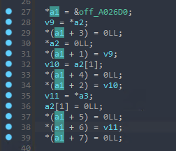
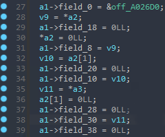

# Post HexRays ANalysis Kit

## About

Phrank helps with structure analysis and function pointers. Phrank works on top of HexRays ctrees.

## Installation

1) Copy/link phrank_plugin.py to IDAPRO/plugins/
2) Copy/link pyphrank and phrank.py to IDAPRO/python/3/ folder  

## Capabilities

1) Analyze pointer variable: automatically calculate pointed structure size, create new structure and set variable type

2) Analyze C++ classes with multiple inheritance: detect multiple inheritance among C++ classses, detect virtual tables, create structures for virtual tables, detect and set C++ objects in functions

## How to use

There are currently two ways to use phrank: hotkey actions (described [here](https://github.com/Mizari/phrank/wiki/Phrank-plugin-and-actions) and in comments [here](https://github.com/Mizari/phrank/blob/master/phrank_plugin.py)) and phrank api (described in docstring comments [here](https://github.com/Mizari/phrank/blob/master/phrank.py)).
